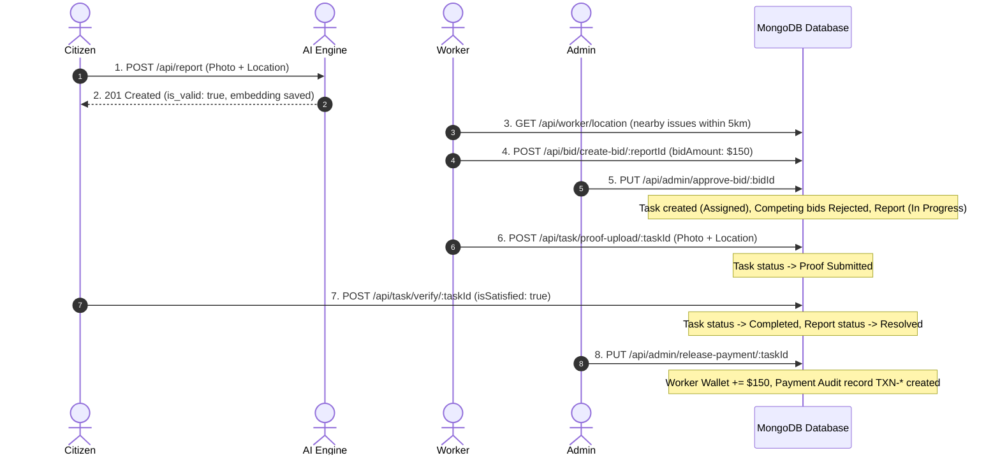

# SnapFix: Automated Testing Strategy & Test Case Specification

This document provides a comprehensive test plan for the **SnapFix** civic issue management platform. It explicitly separates **Unit Testing**, **Integration Testing**, and **End-to-End (E2E) Workflow Verification**, including a detailed **Coverage Gap Analysis & Traceability Matrix** addressing all previously untested modules and edge cases.

---

## 🏗️ 1. Testing Pyramid & Test Types Summary

```text
               / \
              /   \     E2E Workflow Tests (Full Lifecycle: Citizen -> Worker -> Admin)
             / E2E \    [Tool: Playwright / Cypress / Supertest End-to-End Pipeline]
            /-------\
           /         \   Integration Tests (Route + Controller + MongoDB + Cloudinary + FastAPI)
          / Integration \ [Tool: Jest + Supertest + MongoDB Memory Server + Pytest]
         /---------------\
        /                 \  Unit Tests (Isolated Pure Functions, Math, Schemas, & Utilities)
       /       Unit        \ [Tool: Jest Unit Runner, Pytest Native]
      /---------------------\
```

| Testing Level | Scope | Execution Target | Mocking / Dependencies |
| :--- | :--- | :--- | :--- |
| **Unit Testing** | Isolated functions, mathematical algorithms, utilities, and schema validation rules | `calculateCosineSimilarity`, prompt normalization, JWT generation, bcrypt hashing, Mongoose model validations | **Fully Isolated** (No DB connection, no network requests) |
| **Integration Testing** | API endpoint routing, controller logic, database operations, and multi-service contracts | Express routes, MongoDB `2dsphere` spatial queries, Cloudinary upload promises, FastAPI AI HTTP endpoints | **Semi-Isolated** (MongoDB In-Memory Server, Mocked External APIs or live test server) |
| **End-to-End (E2E)** | Full multi-actor civic operations lifecycle across Citizen, Worker, Admin, and AI services | Issue reporting $\rightarrow$ AI validation $\rightarrow$ Spatial deduplication $\rightarrow$ Worker bidding $\rightarrow$ Admin assignment $\rightarrow$ Proof upload $\rightarrow$ Citizen verification $\rightarrow$ Financial settlement | **Full Stack Integration** (Live test environment or full mock server) |

---

## 🔍 2. Test Coverage Audit & Untested Areas Breakdown

Based on backend test coverage execution across the repository:

### Current Baseline Metrics
- **Overall Code Coverage**: 59.5% Statements | 45.7% Branches | 54.5% Functions | 60.0% Lines
- **Server Core (`Server/`)**: 84.2% Statements | 25.0% Branches
- **Controllers (`Server/controllers/`)**: 49.9% Statements | 38.2% Branches | 44.7% Functions
- **Middleware (`Server/middleware/`)**: 80.8% Statements | 76.9% Branches
- **Models (`Server/models/`)**: 96.6% Statements | 95.8% Branches

### Untested & Under-Tested Areas Summary

| Component / Module | Current Stmt Coverage | Untested Code Paths & Edge Cases | Target Test Cases |
| :--- | :--- | :--- | :--- |
| **`authController.js`** | **8.06%** | Registration & login for Citizens, Gig Workers, and Admin; password hashing validation; duplicate email conflicts; missing GPS coordinates; admin auto-creation fallback; 500 error catch blocks. | `IT-AUTH-01` to `IT-AUTH-07` |
| **`userController.js`** | **5.88%** | `myReports` endpoint (`GET /api/user/my-reports`); population of associated task status, proofs, ratings; empty report list handling; unauthenticated access guards. | `IT-USR-01`, `IT-USR-02` |
| **`notificationController.js`** | **26.31%** | Notification feed retrieval (`GET /api/notifications`); role-based filtering (User/Worker/Admin); marking notifications as read (`PUT /api/notifications/read/:id`). | `IT-NOTIF-01`, `IT-NOTIF-02` |
| **`taskController.js`** | **48.38%** | Proof upload validation (missing files, coordinates); non-assigned worker rejection; duplicate proof submission block; citizen work rejection branch (`isSatisfied: false`); worker task listing (`getMyTasks`); task details access control (`getTaskDetail`). | `IT-TSK-01` to `IT-TSK-09` |
| **`workerController.js`** | **58.33%** | Worker profile retrieval (`GET /api/worker/profile`); non-worker role access block (403); missing/invalid worker GPS coordinate handling in feed. | `IT-WRK-01`, `IT-WRK-02` |
| **`adminController.js`** | **50.00%** | `viewAllReports` role authorization; `viewReportWithBid` missing reports/bids; `getCompletedTasks` payout list aggregation; non-admin 403 guards; unverified task payment block; unlinked worker payment edge cases. | `IT-ADM-04` to `IT-ADM-07` |
| **`ReportController.js`** | **71.52%** | Missing image / location input validation; upvote toggle & removal (`POST /api/report/upvote/:id`); single report detail retrieval (`GET /api/report/get-report/:id`); zero-report user location query. | `IT-USR-03` to `IT-USR-07` |
| **`authMiddleware.js`** | **80.76%** | Missing/malformed Authorization header (`Bearer`); unknown token roles; expired session/deleted user account handling; invalid token catch block. | `IT-AUTH-08` to `IT-AUTH-10` |
| **Model Schemas** | **96.55%** | User schema validation rules, Worker approval status enums, Payment audit constraints, Notification enums. | `UT-SCH-04` to `UT-SCH-07` |

---

## 🧩 3. Unit Testing Suite (Pure Functions, Schemas & Security Utilities)

Unit tests focus on isolated business math, schema validations, authentication helpers, and security utility functions without database or network overhead.

| Test Case ID | Test Type | Test Objective | Inputs / Context | Expected Outcome | File Under Test |
| :--- | :--- | :--- | :--- | :--- | :--- |
| **UT-MATH-01** | **Unit** | Cosine Similarity Identical Vectors | `vec1 = [0.6, 0.8]`, `vec2 = [0.6, 0.8]` | `calculateCosineSimilarity` returns `1.0` | [ReportController.js](file:///c:/Users/hp/Music/MyProjects/SnapFix/Server/controllers/ReportController.js) |
| **UT-MATH-02** | **Unit** | Cosine Similarity Orthogonal Vectors | `vec1 = [1.0, 0.0]`, `vec2 = [0.0, 1.0]` | `calculateCosineSimilarity` returns `0.0` | [ReportController.js](file:///c:/Users/hp/Music/MyProjects/SnapFix/Server/controllers/ReportController.js) |
| **UT-MATH-03** | **Unit** | Cosine Similarity Mismatched Dimensions | `vec1 = [0.5, 0.5]`, `vec2 = [0.5, 0.5, 0.5]` | Returns `0` (graceful mismatch handling) | [ReportController.js](file:///c:/Users/hp/Music/MyProjects/SnapFix/Server/controllers/ReportController.js) |
| **UT-MATH-04** | **Unit** | Cosine Similarity Null/Empty Vectors | `vec1 = null`, `vec2 = []` | Returns `0` (null-safe handling) | [ReportController.js](file:///c:/Users/hp/Music/MyProjects/SnapFix/Server/controllers/ReportController.js) |
| **UT-SCH-01** | **Unit** | Report Schema Geospatial Index Format | Construct Report document with invalid coordinates `[181, 91]` | Schema validation throws error (`Longitude -180..180, Latitude -90..90`) | [reportModel.js](file:///c:/Users/hp/Music/MyProjects/SnapFix/Server/models/reportModel.js) |
| **UT-SCH-02** | **Unit** | Bid Schema Amount Validation | Construct Bid document with negative amount `bidAmount: -50` | Schema validation fails (`bidAmount min: 0`) | [bidModel.js](file:///c:/Users/hp/Music/MyProjects/SnapFix/Server/models/bidModel.js) |
| **UT-SCH-03** | **Unit** | Task Rating Bound Validation | Construct Task verification with rating `6` | Schema validation fails (`rating max: 5`) | [taskAssignmentModel.js](file:///c:/Users/hp/Music/MyProjects/SnapFix/Server/models/taskAssignmentModel.js) |
| **UT-SCH-04** | **Unit** | User Schema Required Fields & Defaults | Construct User document missing required `email` or `password` | Schema validation fails on missing required fields; default role is `"citizen"` | [userModel.js](file:///c:/Users/hp/Music/MyProjects/SnapFix/Server/models/userModel.js) |
| **UT-SCH-05** | **Unit** | Gig Worker Approval Status Enum | Construct Worker document with invalid status `approvedStatus: "Random"` | Schema validation fails; allowed values: `["Pending", "Approved", "Rejected"]` | [gigWorkerModel.js](file:///c:/Users/hp/Music/MyProjects/SnapFix/Server/models/gigWorkerModel.js) |
| **UT-SCH-06** | **Unit** | Payment Schema Non-Negative Amount | Construct Payment document with `amount: -100` | Schema validation fails (`amount min: 0`) | [paymentModel.js](file:///c:/Users/hp/Music/MyProjects/SnapFix/Server/models/paymentModel.js) |
| **UT-SCH-07** | **Unit** | Notification UserType Enum Validation | Construct Notification with `userType: "SuperUser"` | Schema validation fails; allowed values: `["User", "Worker", "Admin"]` | [notificationModel.js](file:///c:/Users/hp/Music/MyProjects/SnapFix/Server/models/notificationModel.js) |
| **UT-AUTH-01**| **Unit** | JWT Sign & Verification Utility | Payload `{ id: "123", role: "citizen" }` | Correctly signs token and verifies payload fields without throwing error | [authController.js](file:///c:/Users/hp/Music/MyProjects/SnapFix/Server/controllers/authController.js) |
| **UT-AUTH-02**| **Unit** | Password Hash Comparison | Plaintext `"secret123"`, hashed string | `bcrypt.compare` returns `true` for valid password, `false` for invalid | [authController.js](file:///c:/Users/hp/Music/MyProjects/SnapFix/Server/controllers/authController.js) |
| **UT-AI-01**  | **Unit** | Prompt Vector L2 Normalization | Pre-calculated text feature tensor | Tensor norm $\sqrt{\sum x_i^2} = 1.0 \pm 1e-5$ | [Model/main.py](file:///c:/Users/hp/Music/MyProjects/SnapFix/Model/main.py) |

---

## 🔌 4. Integration Testing Suite (Controllers, API Routes & Database)

Integration tests verify API routes, MongoDB `2dsphere` queries, parallel I/O promises, controller business logic, error handling, and role authorization middleware.

### Suite A: AI Perception Service Integration (`Model/main.py`)

| Test Case ID | Test Type | Test Objective | Input / Context | Expected Outcome | Critical Metric |
| :--- | :--- | :--- | :--- | :--- | :--- |
| **IT-AI-01** | **Integration** | Valid Civic Image Classification | Upload `pothole1.jpg` to `POST /get_embedding` | Returns `is_valid: true`, `confidence > 0.55`, 512-dim vector | `confidence >= 0.55` |
| **IT-AI-02** | **Integration** | Non-Civic Image Filtering | Upload `random.png` (furniture/indoor) to `POST /get_embedding` | Returns `is_valid: false`, `confidence < 0.55` | `confidence < 0.55` |
| **IT-AI-03** | **Integration** | Corrupted Image Upload | Send non-image string buffer to `POST /get_embedding` | Returns HTTP **400 Bad Request** (`Invalid image file`) | HTTP 400 |
| **IT-AI-04** | **Integration** | Service Health Check | Send request to `GET /health` | Returns HTTP **200 OK** (`{"status": "ok"}`) | HTTP 200 |

### Suite B: Report Intake & Deduplication Integration (`Server/controllers/ReportController.js`)

| Test Case ID | Test Type | Test Objective | Input / Context | Expected Outcome | Critical Metric |
| :--- | :--- | :--- | :--- | :--- | :--- |
| **IT-REP-01** | **Integration** | Report Ingestion + Parallel I/O | Send multipart form payload (`image`, `title`, `category`, `lat`, `long`) | HTTP **201 Created**, Cloudinary URL saved, AI vector attached | HTTP 201 |
| **IT-REP-02** | **Integration** | Spatial + Vector Duplicate Suppression | Submit report within **50m** of open issue with vector similarity $> 0.90$ | HTTP **200 OK**, `isDuplicate: true`, upvotes incremented (`$inc: 1`), user added to `upvotedUsers` | Cosine Sim $> 0.90$ |
| **IT-REP-03** | **Integration** | Fault Tolerant AI Fallback | AI server offline/timed out; submit report within **50m** with matching `category` | Falls back to category-based matching; upvotes existing report | System Resilience |
| **IT-REP-04** | **Integration** | Geospatial Feed Querying | Query `GET /api/report/location` with user report coordinates | Returns array of open reports within **5000m (5km)** radius | MongoDB `2dsphere` |
| **IT-REP-05** | **Integration** | Post-Response Async Operations | Submit valid report payload | User `reports` array updated & notification created **after** HTTP 201 is sent | Non-blocking async |

### Suite C: Bidding & Worker Discovery Integration (`Server/controllers/bidController.js` & `workerController.js`)

| Test Case ID | Test Type | Test Objective | Input / Context | Expected Outcome | Critical Metric |
| :--- | :--- | :--- | :--- | :--- | :--- |
| **IT-BID-01** | **Integration** | Worker Bid Creation | Worker posts bid (`bidAmount`, `resourceNote`, `duration`) for valid report | HTTP **201 Created**, Bid status `Pending` | HTTP 201 |
| **IT-BID-02** | **Integration** | Duplicate Bid Constraint Enforcement | Same worker posts second bid for same report | Returns HTTP **400 Bad Request** (`Already placed a bid...`) | Compound Unique Index |
| **IT-BID-03** | **Integration** | Worker Nearby Job Query | Gig worker queries `GET /api/worker/reports/nearby` | Returns reports within **5000m** of worker location + list of worker's bid report IDs | Radius 5000m |

### Suite D: Admin Assignment & Payout Integration (`Server/controllers/adminController.js`)

| Test Case ID | Test Type | Test Objective | Input / Context | Expected Outcome | Critical Metric |
| :--- | :--- | :--- | :--- | :--- | :--- |
| **IT-ADM-01** | **Integration** | Bid Approval & Task Assignment | Admin approves pending bid via `PUT /api/admin/approve-bid/:bidId` | Selected bid $\rightarrow$ `Approved`, Task created, Report status $\rightarrow$ `In Progress` | State Cascade |
| **IT-ADM-02** | **Integration** | Competing Bids Cascading Rejection | Admin approves Bid A for Report X which has pending Bids B and C | Bids B and C automatically updated to `Rejected` | Bulk Update |
| **IT-ADM-03** | **Integration** | Double Task Assignment Guard | Admin attempts to approve Bid B for Report X after Task already created | Returns HTTP **400 Bad Request** (`Task already assigned for this report`) | Anti-double assign |
| **IT-PAY-01** | **Integration** | Financial Payout Settlement | Admin calls `PUT /api/admin/release-payment/:taskId` when `verifiedByCitizen: true` | Worker `walletBalance` incremented, `Payment` audit document created with `TXN-*` ID | Financial Audit |
| **IT-PAY-02** | **Integration** | Unverified Payout Block | Admin attempts payout release on task with `verifiedByCitizen: false` | Returns HTTP **400 Bad Request** (`Payment cannot be released until verified...`) | Gated Settlement |

### Suite E: Authentication, Registration & Session Management (NEW)

| Test Case ID | Test Type | Test Objective | Input / Context | Expected Outcome | Critical Metric |
| :--- | :--- | :--- | :--- | :--- | :--- |
| **IT-AUTH-01**| **Integration** | Citizen Registration | `POST /api/auth/register-citizen` with valid `name, email, password` | HTTP **201 Created**, password hashed with bcrypt, user record persisted | HTTP 201 |
| **IT-AUTH-02**| **Integration** | Duplicate Citizen Email Conflict | `POST /api/auth/register-citizen` with already registered email | HTTP **409 Conflict** (`User already registered`) | HTTP 409 |
| **IT-AUTH-03**| **Integration** | Citizen Login (Valid vs Invalid Credentials) | `POST /api/auth/login-citizen` with correct password vs incorrect password | Correct: HTTP **200 OK** + JWT token; Incorrect: HTTP **400 Bad Request** (`Invalid Credentials`) | Token Dispatch |
| **IT-AUTH-04**| **Integration** | Gig Worker Registration with Geospatial Point | `POST /api/auth/register-worker` with `name, email, skills (comma string / array), lat, long` | HTTP **201 Created**, skills parsed as array, GeoJSON Point `[long, lat]` created | GeoJSON Point |
| **IT-AUTH-05**| **Integration** | Gig Worker Registration Missing Location | `POST /api/auth/register-worker` without `latitude` or `longitude` | HTTP **400 Bad Request** (`Location is missing`) | Input Validation |
| **IT-AUTH-06**| **Integration** | Gig Worker Login | `POST /api/auth/login-worker` with registered worker credentials | HTTP **200 OK** + JWT token with `role: 'gigworker'` | HTTP 200 |
| **IT-AUTH-07**| **Integration** | Admin Login & Auto-Bootstrap | `POST /api/auth/login-admin` matching env `ADMIN_EMAIL` & `ADMIN_PASSWORD` | HTTP **200 OK**, auto-creates admin document if first run, returns admin token with `role: 'Local'` | Admin Bootstrap |
| **IT-AUTH-08**| **Integration** | JWT Auth Middleware Header Validation | Request protected route (`GET /api/user/my-reports`) without `Bearer` header | HTTP **401 Unauthorized** (`Token not provided`) | HTTP 401 |
| **IT-AUTH-09**| **Integration** | JWT Auth Middleware Expired/Invalid Token | Request protected route with tampered or expired JWT string | HTTP **401 Unauthorized** (`Invalid Or Expired Token`) | HTTP 401 |
| **IT-AUTH-10**| **Integration** | Auth Middleware Account Role Resolution | Request with valid token for deleted account ID | HTTP **404 Not Found** (`Session expired`) | Account Existence |

### Suite F: Task Execution, Proofs & Citizen Verification (NEW)

| Test Case ID | Test Type | Test Objective | Input / Context | Expected Outcome | Critical Metric |
| :--- | :--- | :--- | :--- | :--- | :--- |
| **IT-TSK-01** | **Integration** | Worker Work Proof Upload | Assigned worker uploads photo + `remarks, lat, long` to `POST /api/task/proof-upload/:id` | HTTP **200 OK**, Cloudinary image URL stored, `status: 'Proof Submitted'`, citizen notified | State Transition |
| **IT-TSK-02** | **Integration** | Proof Upload Role & Ownership Guards | Non-worker or unassigned worker attempts `POST /api/task/proof-upload/:id` | Returns HTTP **403 Forbidden** (`Access denied` / `You are not assigned to this task`) | Access Control |
| **IT-TSK-03** | **Integration** | Proof Upload Missing Image / Coordinates | Worker submits proof without `req.file` or without `latitude/longitude` | HTTP **400 Bad Request** (`Image is required` / `Location is missing`) | Input Validation |
| **IT-TSK-04** | **Integration** | Double Proof Submission Guard | Worker calls `proof-upload` when task status is already `'Proof Submitted'` | HTTP **400 Bad Request** (`Proof already submitted`) | Idempotency |
| **IT-TSK-05** | **Integration** | Citizen Task Acceptance | Citizen calls `POST /api/task/verify/:id` with `{ isSatisfied: true }` | HTTP **200 OK**, Task $\rightarrow$ `'Completed'`, Report $\rightarrow$ `'Resolved'`, worker notified | Verification Positive |
| **IT-TSK-06** | **Integration** | Citizen Task Rejection (Rework Trigger) | Citizen calls `POST /api/task/verify/:id` with `{ isSatisfied: false }` | HTTP **200 OK**, Task $\rightarrow$ `'Rejected'`, Report $\rightarrow$ `'Rejected'`, worker notified | Verification Negative |
| **IT-TSK-07** | **Integration** | Citizen Verification Ownership Guard | User other than the report creator attempts `POST /api/task/verify/:id` | HTTP **403 Forbidden** (`You are not authorised to verify the task`) | Access Control |
| **IT-TSK-08** | **Integration** | Worker Assigned Tasks Query | Worker queries `GET /api/task/my-tasks` | HTTP **200 OK**, returns list of tasks assigned to authenticated worker with populated report info | Query Filtering |
| **IT-TSK-09** | **Integration** | Task Detail Access Control | Assigned worker or Admin queries `GET /api/task/:id` vs random citizen | Worker/Admin: HTTP **200 OK** with details; Random user: HTTP **403 Forbidden** | Authorization Gate |

### Suite G: User Profile & Community Reports (NEW)

| Test Case ID | Test Type | Test Objective | Input / Context | Expected Outcome | Critical Metric |
| :--- | :--- | :--- | :--- | :--- | :--- |
| **IT-USR-01** | **Integration** | User Reports & Associated Tasks Retrieval | Citizen queries `GET /api/user/my-reports` | HTTP **200 OK**, returns created reports with populated task status, proof, rating + upvoted reports | Complex Population |
| **IT-USR-02** | **Integration** | User Reports Empty State | Citizen with 0 reports queries `GET /api/user/my-reports` | HTTP **200 OK** with `{ reports: [], upvotedReports: [] }` (no error thrown) | Empty Handling |
| **IT-USR-03** | **Integration** | Report Upvote Toggle (Add Upvote) | Citizen calls `POST /api/report/upvote/:id` on existing report | HTTP **200 OK**, `upvotes` incremented by 1, user ID added to `upvotedUsers`, creator notified | Community Upvote |
| **IT-USR-04** | **Integration** | Report Upvote Toggle (Remove Upvote) | Citizen calls `POST /api/report/upvote/:id` second time | HTTP **200 OK**, `upvotes` decremented by 1, user ID removed from `upvotedUsers` | Toggle Mechanism |
| **IT-USR-05** | **Integration** | Single Report Detail Query | Query `GET /api/report/get-report/:id` for valid report vs invalid ID | Valid: HTTP **200 OK** with report; Invalid ID: HTTP **400 Bad Request** (`Could not find report`) | Query Lookup |
| **IT-USR-06** | **Integration** | Report Creation Missing Inputs | Submit `POST /api/report/create-report` with missing image file or missing lat/long | HTTP **400 Bad Request** (`Image is required` / `Location is missing`) | Input Validation |
| **IT-USR-07** | **Integration** | Location Feed for Zero-Report User | Query `GET /api/report/location` when user has no prior submitted reports | HTTP **200 OK** with empty reports array (`No previous reports found for user`) | Feed Fallback |

### Suite H: Worker Profile & Admin Reporting (NEW)

| Test Case ID | Test Type | Test Objective | Input / Context | Expected Outcome | Critical Metric |
| :--- | :--- | :--- | :--- | :--- | :--- |
| **IT-WRK-01** | **Integration** | Worker Profile Retrieval | Worker queries `GET /api/worker/profile` vs Citizen attempting query | Worker: HTTP **200 OK** with profile; Citizen: HTTP **403 Forbidden** (`Access Denied`) | Role Gate |
| **IT-WRK-02** | **Integration** | Worker Feed Missing Location Guard | Worker with missing/null coordinates queries `GET /api/worker/location` | HTTP **400 Bad Request** (`Worker location not set`) | Geospatial Guard |
| **IT-ADM-04** | **Integration** | Admin View All Reports | Admin queries `GET /api/admin/all-reports` vs Citizen attempting query | Admin: HTTP **200 OK** with all reports; Citizen: HTTP **403 Forbidden** | RBAC Gate |
| **IT-ADM-05** | **Integration** | Admin View Report With Bids | Admin queries `GET /api/admin/bids/:id` with populated worker details | HTTP **200 OK** with report and bids; HTTP **404** if report or bids absent | Detailed Audit |
| **IT-ADM-06** | **Integration** | Admin Completed Tasks Pending Payout | Admin queries `GET /api/admin/completed-tasks` | HTTP **200 OK**, lists tasks where `status: 'Completed'`, `verifiedByCitizen: true`, `paymentStatus: 'Pending'` with approved bid amounts | Payout Queue |
| **IT-ADM-07** | **Integration** | Payment Release Duplicate Guard | Admin attempts `PUT /api/admin/release-payment/:id` on already released task | HTTP **400 Bad Request** (`Payment has already been released for this task`) | Financial Double-Spend Guard |

### Suite I: Notifications System (NEW)

| Test Case ID | Test Type | Test Objective | Input / Context | Expected Outcome | Critical Metric |
| :--- | :--- | :--- | :--- | :--- | :--- |
| **IT-NOTIF-01**| **Integration** | Notification Feed Retrieval | User/Worker/Admin queries `GET /api/notifications` | HTTP **200 OK**, returns notifications matching user ID and role type, sorted desc, max 50 | Feed Pagination |
| **IT-NOTIF-02**| **Integration** | Mark Notification as Read | User calls `PUT /api/notifications/read/:id` | HTTP **200 OK**, notification document updated to `isRead: true` | State Mutation |

---

## 🔄 5. End-to-End (E2E) System Workflow Testing

E2E testing evaluates the complete multi-actor operational workflow across all system components from citizen submission to financial settlement.

### Workflow 1: Happy Path Civic Issue Resolution & Payout Settlement



### Workflow 2: Work Quality Dispute & Citizen Rejection Lifecycle (NEW)

| Step | Actor | Action & Endpoint | Expected State Change |
| :--- | :--- | :--- | :--- |
| 1 | Citizen | `POST /api/report/create-report` | Report created in `"Pending"` status. |
| 2 | Worker | `POST /api/bid/create-bid/:id` | Bid placed in `"Pending"` status. |
| 3 | Admin | `PUT /api/admin/approve-bid/:id` | Bid approved; Task assigned to worker; Report `"In Progress"`. |
| 4 | Worker | `POST /api/task/proof-upload/:id` | Proof uploaded; Task status $\rightarrow$ `"Proof Submitted"`. |
| 5 | Citizen | `POST /api/task/verify/:id` with `{ isSatisfied: false }` | Task status $\rightarrow$ `"Rejected"`, Report status $\rightarrow$ `"Rejected"`, Worker notified of rejection. |
| 6 | Admin | `PUT /api/admin/release-payment/:id` | Rejected: HTTP **400 Bad Request** (Payment blocked on unverified/rejected tasks). |

### Workflow 3: Multi-Worker Competitive Bidding & Payout Lifecycle (NEW)

| Step | Actor | Action & Endpoint | Expected State Change |
| :--- | :--- | :--- | :--- |
| 1 | Citizen | `POST /api/report/create-report` | Report created in `"Pending"` status. |
| 2 | Worker A | `POST /api/bid/create-bid/:id` (Amount: $200) | Bid A created in `"Pending"` status. |
| 3 | Worker B | `POST /api/bid/create-bid/:id` (Amount: $150) | Bid B created in `"Pending"` status. |
| 4 | Admin | `PUT /api/admin/approve-bid/:bidBId` | Bid B $\rightarrow$ `"Approved"`, Bid A $\rightarrow$ `"Rejected"`, Task assigned to Worker B. |
| 5 | Worker B | `POST /api/task/proof-upload/:taskId` | Proof uploaded by Worker B; Task status $\rightarrow$ `"Proof Submitted"`. |
| 6 | Citizen | `POST /api/task/verify/:taskId` with `{ isSatisfied: true }` | Task status $\rightarrow$ `"Completed"`, Report $\rightarrow$ `"Resolved"`. |
| 7 | Admin | `PUT /api/admin/release-payment/:taskId` | Worker B wallet balance credited +$150; Payment record `TXN-*` generated; Task `paymentStatus: 'Released'`. |

---

## 📊 6. Summary Comparison of Test Types

| Feature / Metric | Unit Testing | Integration Testing | End-to-End (E2E) Testing |
| :--- | :--- | :--- | :--- |
| **Target Code** | Pure helper functions (`calculateCosineSimilarity`, JWT sign/verify, schema rules, bcrypt hashing) | Express controllers, route endpoints, MongoDB indexes (`2dsphere`, compound unique), Cloudinary/FastAPI promises, RBAC middleware | Full closed-loop lifecycle across all 3 roles (Citizen, Worker, Admin) and services |
| **Database Dependency** | None (In-Memory Mock / Pure Stubs) | MongoDB In-Memory Server (`mongodb-memory-server`) | Real MongoDB instance or isolated In-Memory Test DB |
| **Execution Speed** | Ultra-Fast ($< 50\text{ms}$) | Fast ($100\text{ms} - 500\text{ms}$) | Moderate ($1\text{s} - 5\text{s}$) |
| **Total Test Count** | **14 Test Cases** (`UT-*`) | **36 Test Cases** (`IT-*`) | **3 Workflow Sequences** (`E2E-*`) |

---

## 📋 7. Recommended Execution Commands

### Run Unit & Integration Tests (Backend API)
```bash
cd Server
npm test -- --coverage
```

### Run AI Perception Service Tests (Python FastAPI)
```bash
cd Model
pytest --verbose
```

