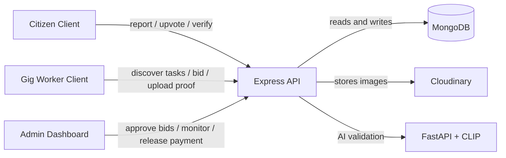

# SnapFix

SnapFix is a civic issue management platform that turns public complaints into an operational workflow. The project connects citizens, gig workers, and administrators through a single closed loop: report an issue, validate it, assign work, verify completion, and release payment only after evidence is confirmed.

This repository is not a single app; it is a multi-part system that includes a React client for citizens and workers, a government/admin dashboard, an Express API, MongoDB persistence, and a Python AI service that validates whether uploaded images match real civic problems.

## Why this project exists

Most civic issue systems fail because they stop at submission. A problem gets reported, but there is no reliable path from complaint to execution to closure. SnapFix tries to address that gap by making the lifecycle explicit and auditable.

The underlying workflow is:

Report → Validate → Deduplicate → Assign → Execute → Verify → Settle

- 3 app surfaces: citizen/worker frontend, admin dashboard, and AI service
- 8 backend route modules in the API layer
- 8 controller modules implementing the operational logic
- 8 Mongoose model files defining the data model
- 3 role domains: citizen, gig worker, and admin
- 2 geospatial workflow patterns built on MongoDB 2dsphere queries
- 1 FastAPI-based AI validation service using CLIP
- 1 Cloudinary media pipeline for photo uploads
- 1 notification layer for state transitions and user-facing updates

## Architecture



### 1. Frontend layer

The repository contains two React applications:

- [Client](Client): citizen and gig worker experience
- [Admin](Admin): government/admin operations dashboard

This split is intentional. Citizens and workers do not share the same service model, and the admin surface is a separate operational tool with monitoring and assignment workflows.

### 2. API layer

The backend entry point is [Server/server.js](Server/server.js). It initializes the Express app, registers route modules, sets up CORS for the known frontend origins, connects to MongoDB, and configures Cloudinary.

The API is organized by domain and responsibility:

- authentication and account handling
- report submission and duplicate detection
- worker bidding
- task proof submission and verification
- admin assignment and payout authorization
- notifications

The main route modules are under [Server/routes](Server/routes).

### 3. Persistence layer

The database model is implemented with Mongoose under [Server/models](Server/models). The important collections include:

- User
- Worker
- Admin
- Report
- Bid
- Task
- Notification
- Payment

The data model is tightly tied to the lifecycle of civic operations. Reports carry coordinates, embeddings, AI confidence, status, and user metadata instead of being merely freeform text records.

### 4. AI validation layer

The Python service in [Model/main.py](Model/main.py) uses CLIP to classify whether an uploaded image looks like a valid civic issue. It computes image embeddings, compares them against zero-shot text prompts, and returns:

- an embedding vector
- a validity flag
- a confidence score

This is a pragmatic validation gate before a report becomes part of the operational workflow, not a full custom training pipeline.

## Core workflows

### Citizen report creation

The most important orchestration is in [Server/controllers/ReportController.js](Server/controllers/ReportController.js).

The flow is:

1. User submits a report with title, description, category, and coordinates.
2. The backend validates the location and uploads the image to Cloudinary.
3. The same file is sent to the AI service for semantic validation.
4. The AI service returns `is_valid` and `confidence`.
5. If the image is rejected, the report is not created.
6. The backend checks nearby reports using a MongoDB geospatial query.
7. If a similar issue already exists nearby, the user’s action becomes an upvote rather than a duplicate report.
8. Otherwise, a new report is created with metadata, embedding, status, and image URL.

This is one of the repository’s strongest technical paths because it combines media upload, geospatial matching, AI validation, and domain persistence in one request.

### Worker discovery and bidding

Worker workflows are implemented across [Server/controllers/workerController.js](Server/controllers/workerController.js) and [Server/controllers/bidController.js](Server/controllers/bidController.js).

A worker queries nearby reports using geospatial filters and makes a bid with amount, notes, and duration. The bid model enforces a uniqueness constraint to prevent duplicate bids for the same report from the same worker.

### Admin assignment and payout

The admin workflow sits in [Server/controllers/adminController.js](Server/controllers/adminController.js). An administrator can:

- review issues
- approve a worker bid
- assign a task
- track progress
- release payment only after required checks are complete

This is where the project transitions from issue tracking to operational settlement.

### Proof submission and citizen verification

The task lifecycle is implemented in [Server/controllers/taskController.js](Server/controllers/taskController.js).

After assignment, the worker uploads proof of completed work. The citizen then verifies whether the work is satisfactory:

- if accepted, the task is marked complete and the report is resolved
- if rejected, the task stays rejected and the report is marked unsuccessful

This creates an accountability gate and prevents automatic closure based on a single worker action.

### Notifications

The notification mechanism in [Server/controllers/notificationController.js](Server/controllers/notificationController.js) ties the domain together. It tracks state transitions for users and workers such as:

- report creation
- duplicate detection
- bid approval
- proof submission
- verification or rejection
- payment release

Notifications are not stylistic extras; they are operational status updates that keep the system legible to all participants.

## Important technical decisions

### Geospatial logic

The project relies on MongoDB geospatial support via `2dsphere` indexes. The report and worker flows use proximity queries to find nearby open issues and nearby task opportunities.

This matters for two reasons:

- duplicate suppression before new reports are created
- worker discovery of local civic tasks

### AI validation as a soft but useful gate

The AI layer in [Model/main.py](Model/main.py) loads `openai/clip-vit-base-patch32` and compares the image to a set of zero-shot prompts. It then calculates a confidence score and marks the image as valid only when the result crosses a threshold.

This helps reduce low-quality or irrelevant uploads from polluting the system without trying to build a full public-sector classification system in one step.

### Proof-before-payment

One of the clearest design decisions in the codebase is that the system does not automatically release money just because a task is assigned. Payment is gated by verification and task state. This is a meaningful trust mechanism.

### Role-aware access control

Authentication is implemented in [Server/controllers/authController.js](Server/controllers/authController.js) with `bcrypt` and JWTs. Different roles are resolved at the middleware layer and enforced in protected routes.

This keeps the access model simple but workable for a three-role system.

## Project structure

```text
SnapFix/
├── Admin/
│   ├── src/
│   ├── package.json
│   └── vite.config.js
├── Client/
│   ├── src/
│   ├── package.json
│   └── vite.config.js
├── Model/
│   ├── app/
│   ├── test/
│   ├── main.py
│   ├── Dockerfile
│   └── requirements.txt
├── Server/
│   ├── config/
│   ├── controllers/
│   ├── middleware/
│   ├── models/
│   ├── routes/
│   ├── scratch/
│   ├── .env
│   ├── package.json
│   ├── server.js
│   └── README.md
├── README.md
└── ...
```

## Tech stack

| Layer | Technology | Role |
| --- | --- | --- |
| Frontend | React + Vite | User interfaces for citizens, workers, and admins |
| API | Node.js + Express | Business logic and route orchestration |
| Persistence | MongoDB + Mongoose | Durable issue, bid, task, and payment state |
| AI | FastAPI + CLIP | Semantic validation of uploaded civic images |
| Media | Cloudinary | Photo storage and delivery |
| Auth | JWT + bcrypt | Identity and access control |
| Geospatial | MongoDB 2dsphere | Nearby issue and worker matching |
| Containerization | Docker | AI service packaging |

## Local setup

### Prerequisites

- Node.js and npm
- Python 3.11+
- MongoDB instance
- Cloudinary account
- running AI service or equivalent environment

### 1. Install backend dependencies

```bash
cd Server
npm install
```

### 2. Install the citizen/worker frontend

```bash
cd Client
npm install
```

### 3. Install the admin frontend

```bash
cd Admin
npm install
```

### 4. Start the backend

```bash
cd Server
npm run dev
```

### 5. Start the citizen/worker app

```bash
cd Client
npm run dev
```

### 6. Start the admin app

```bash
cd Admin
npm run dev
```

### 7. Start the AI service

```bash
cd Model
pip install -r requirements.txt
uvicorn main:app --host 0.0.0.0 --port 8000
```

## Bottom line

SnapFix is best described as a civic operations platform, not just a complaint app. It combines report intake, geospatial matching, AI-assisted validation, bid assignment, proof upload, citizen verification, and payment settlement into one workflow.

The real engineering value is in the closed-loop lifecycle and the domain logic that connects the different actors. The repository demonstrates a coherent system for turning local civic complaints into accountable, verified action.
