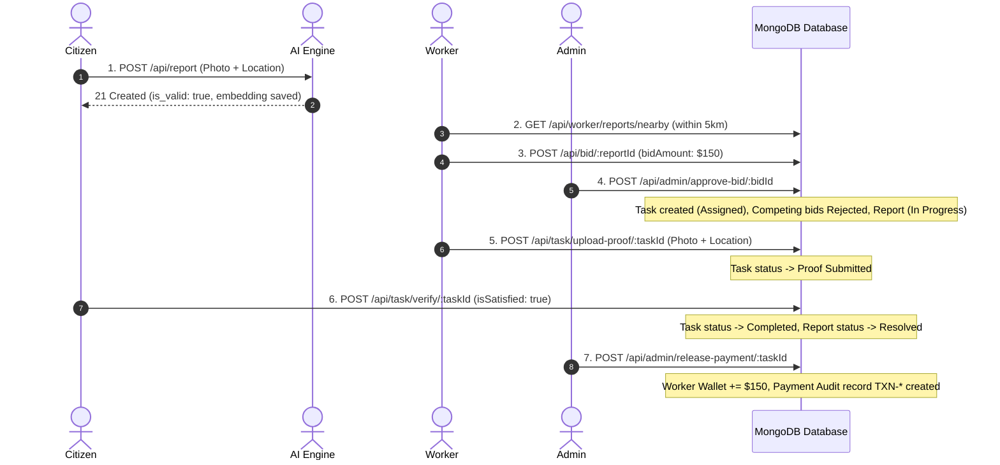

# SnapFix: Automated Testing Strategy & Test Case Specification

This document provides a comprehensive test plan for the **SnapFix** civic issue management platform. It explicitly separates **Unit Testing**, **Integration Testing**, and **End-to-End (E2E) Workflow Verification**.

---

## 🏗️ 1. Testing Pyramid & Test Types Summary

```text
               / \
              /   \     E2E Workflow Tests (Full Lifecycle: Citizen -> Worker -> Admin)
             / E2E \    [Tool: Playwright / Cypress / Supertest End-to-End Pipeline]
            /-------\
           /         \   Integration Tests (Route + Controller + MongoDB + Cloudinary + FastAPI)
          / Integration \ [Tool: Jest + Supertest + MongoDB Memory Server + Pytest]
         /---------------\
        /                 \  Unit Tests (Isolated Pure Functions, Math, Schemas, & Utilities)
       /       Unit        \ [Tool: Jest Unit Runner, Pytest Native]
      /---------------------\
```

| Testing Level | Scope | Execution Target | Mocking / Dependencies |
| :--- | :--- | :--- | :--- |
| **Unit Testing** | Isolated functions, mathematical algorithms, utilities, and schema validation rules | `calculateCosineSimilarity`, prompt normalization, JWT generation, bcrypt hashing, Mongoose model validations | **Fully Isolated** (No DB connection, no network requests) |
| **Integration Testing** | API endpoint routing, controller logic, database operations, and multi-service contracts | Express routes, MongoDB `2dsphere` spatial queries, Cloudinary upload promises, FastAPI AI HTTP endpoints | **Semi-Isolated** (MongoDB In-Memory Server, Mocked External APIs or live test server) |
| **End-to-End (E2E)** | Full multi-actor civic operations lifecycle across Citizen, Worker, Admin, and AI services | Issue reporting $\rightarrow$ AI validation $\rightarrow$ Spatial deduplication $\rightarrow$ Worker bidding $\rightarrow$ Admin assignment $\rightarrow$ Proof upload $\rightarrow$ Citizen verification $\rightarrow$ Financial settlement | **Full Stack Integration** (Live test environment or full mock server) |

---

## 🧩 2. Unit Testing Suite (Pure Functions & Helper Modules)

Unit tests focus on isolated business math, schema validations, authentication helpers, and security utility functions without database or network overhead.

| Test Case ID | Test Type | Test Objective | Inputs / Context | Expected Outcome | File Under Test |
| :--- | :--- | :--- | :--- | :--- | :--- |
| **UT-MATH-01** | **Unit** | Cosine Similarity Identical Vectors | `vec1 = [0.6, 0.8]`, `vec2 = [0.6, 0.8]` | `calculateCosineSimilarity` returns `1.0` | [ReportController.js](file:///c:/Users/hp/Music/MyProjects/SnapFix/Server/controllers/ReportController.js) |
| **UT-MATH-02** | **Unit** | Cosine Similarity Orthogonal Vectors | `vec1 = [1.0, 0.0]`, `vec2 = [0.0, 1.0]` | `calculateCosineSimilarity` returns `0.0` | [ReportController.js](file:///c:/Users/hp/Music/MyProjects/SnapFix/Server/controllers/ReportController.js) |
| **UT-MATH-03** | **Unit** | Cosine Similarity Mismatched Dimensions | `vec1 = [0.5, 0.5]`, `vec2 = [0.5, 0.5, 0.5]` | Returns `0` (graceful mismatch handling) | [ReportController.js](file:///c:/Users/hp/Music/MyProjects/SnapFix/Server/controllers/ReportController.js) |
| **UT-MATH-04** | **Unit** | Cosine Similarity Null/Empty Vectors | `vec1 = null`, `vec2 = []` | Returns `0` (null-safe handling) | [ReportController.js](file:///c:/Users/hp/Music/MyProjects/SnapFix/Server/controllers/ReportController.js) |
| **UT-SCH-01** | **Unit** | Report Schema Geospatial Index Format | Construct Report document with invalid coordinates `[181, 91]` | Schema validation throws error (`Longitude -180..180, Latitude -90..90`) | [reportModel.js](file:///c:/Users/hp/Music/MyProjects/SnapFix/Server/models/reportModel.js) |
| **UT-SCH-02** | **Unit** | Bid Schema Amount Validation | Construct Bid document with negative amount `bidAmount: -50` | Schema validation fails (`bidAmount min: 0`) | [bidModel.js](file:///c:/Users/hp/Music/MyProjects/SnapFix/Server/models/bidModel.js) |
| **UT-SCH-03** | **Unit** | Task Rating Bound Validation | Construct Task verification with rating `6` | Schema validation fails (`rating max: 5`) | [taskAssignmentModel.js](file:///c:/Users/hp/Music/MyProjects/SnapFix/Server/models/taskAssignmentModel.js) |
| **UT-AUTH-01**| **Unit** | JWT Sign & Verification Utility | Payload `{ id: "123", role: "citizen" }` | Correctly signs token and verifies payload fields without throwing error | [authController.js](file:///c:/Users/hp/Music/MyProjects/SnapFix/Server/controllers/authController.js) |
| **UT-AUTH-02**| **Unit** | Password Hash Comparison | Plaintext `"secret123"`, hashed string | `bcrypt.compare` returns `true` for valid password, `false` for invalid | [authController.js](file:///c:/Users/hp/Music/MyProjects/SnapFix/Server/controllers/authController.js) |
| **UT-AI-01**  | **Unit** | Prompt Vector L2 Normalization | Pre-calculated text feature tensor | Tensor norm $\sqrt{\sum x_i^2} = 1.0 \pm 1e-5$ | [Model/main.py](file:///c:/Users/hp/Music/MyProjects/SnapFix/Model/main.py) |

---

## 🔌 3. Integration Testing Suite (Controllers, API Routes & Database)

Integration tests verify API routes, MongoDB `2dsphere` queries, parallel I/O promises, controller business logic, and role authorization middleware.

### Suite A: AI Perception Service Integration (`Model/main.py`)

| Test Case ID | Test Type | Test Objective | Input / Context | Expected Outcome | Critical Metric |
| :--- | :--- | :--- | :--- | :--- | :--- |
| **IT-AI-01** | **Integration** | Valid Civic Image Classification | Upload `pothole1.jpg` to `POST /get_embedding` | Returns `is_valid: true`, `confidence > 0.55`, 512-dim vector | `confidence >= 0.55` |
| **IT-AI-02** | **Integration** | Non-Civic Image Filtering | Upload `random.png` (furniture/indoor) to `POST /get_embedding` | Returns `is_valid: false`, `confidence < 0.55` | `confidence < 0.55` |
| **IT-AI-03** | **Integration** | Corrupted Image Upload | Send non-image string buffer to `POST /get_embedding` | Returns HTTP **400 Bad Request** (`Invalid image file`) | HTTP 400 |
| **IT-AI-04** | **Integration** | Service Health Check | Send request to `GET /health` | Returns HTTP **200 OK** (`{"status": "ok"}`) | HTTP 200 |

### Suite B: Report Intake & Deduplication Integration (`Server/controllers/ReportController.js`)

| Test Case ID | Test Type | Test Objective | Input / Context | Expected Outcome | Critical Metric |
| :--- | :--- | :--- | :--- | :--- | :--- |
| **IT-REP-01** | **Integration** | Report Ingestion + Parallel I/O | Send multipart form payload (`image`, `title`, `category`, `lat`, `long`) | HTTP **201 Created**, Cloudinary URL saved, AI vector attached | HTTP 201 |
| **IT-REP-02** | **Integration** | Spatial + Vector Duplicate Suppression | Submit report within **50m** of open issue with vector similarity $> 0.90$ | HTTP **200 OK**, `isDuplicate: true`, upvotes incremented (`$inc: 1`), user added to `upvotedUsers` | Cosine Sim $> 0.90$ |
| **IT-REP-03** | **Integration** | Fault Tolerant AI Fallback | AI server offline/timed out; submit report within **50m** with matching `category` | Falls back to category-based matching; upvotes existing report | System Resilience |
| **IT-REP-04** | **Integration** | Geospatial Feed Querying | Query `GET /api/report/location` with user report coordinates | Returns array of open reports within **5000m (5km)** radius | MongoDB `2dsphere` |
| **IT-REP-05** | **Integration** | Post-Response Async Operations | Submit valid report payload | User `reports` array updated & notification created **after** HTTP 201 is sent | Non-blocking async |

### Suite C: Bidding & Worker Discovery Integration (`Server/controllers/bidController.js` & `workerController.js`)

| Test Case ID | Test Type | Test Objective | Input / Context | Expected Outcome | Critical Metric |
| :--- | :--- | :--- | :--- | :--- | :--- |
| **IT-BID-01** | **Integration** | Worker Bid Creation | Worker posts bid (`bidAmount`, `resourceNote`, `duration`) for valid report | HTTP **201 Created**, Bid status `Pending` | HTTP 201 |
| **IT-BID-02** | **Integration** | Duplicate Bid Constraint Enforcement | Same worker posts second bid for same report | Returns HTTP **400 Bad Request** (`Already placed a bid...`) | Compound Unique Index |
| **IT-BID-03** | **Integration** | Worker Nearby Job Query | Gig worker queries `GET /api/worker/reports/nearby` | Returns reports within **5000m** of worker location + list of worker's bid report IDs | Radius 5000m |

### Suite D: Admin Assignment & Payout Integration (`Server/controllers/adminController.js`)

| Test Case ID | Test Type | Test Objective | Input / Context | Expected Outcome | Critical Metric |
| :--- | :--- | :--- | :--- | :--- | :--- |
| **IT-ADM-01** | **Integration** | Bid Approval & Task Assignment | Admin approves pending bid via `POST /api/admin/approve-bid/:bidId` | Selected bid $\rightarrow$ `Approved`, Task created, Report status $\rightarrow$ `In Progress` | State Cascade |
| **IT-ADM-02** | **Integration** | Competing Bids Cascading Rejection | Admin approves Bid A for Report X which has pending Bids B and C | Bids B and C automatically updated to `Rejected` | Bulk Update |
| **IT-ADM-03** | **Integration** | Double Task Assignment Guard | Admin attempts to approve Bid B for Report X after Task already created | Returns HTTP **400 Bad Request** (`Task already assigned for this report`) | Anti-double assign |
| **IT-PAY-01** | **Integration** | Financial Payout Settlement | Admin calls `POST /api/admin/release-payment/:taskId` when `verifiedByCitizen: true` | Worker `walletBalance` incremented, `Payment` audit document created with `TXN-*` ID | Financial Audit |
| **IT-PAY-02** | **Integration** | Unverified Payout Block | Admin attempts payout release on task with `verifiedByCitizen: false` | Returns HTTP **400 Bad Request** (`Payment cannot be released until verified...`) | Gated Settlement |

---

## 🔄 4. End-to-End (E2E) System Workflow Testing

E2E testing evaluates the complete multi-actor operational workflow across all system components from citizen submission to financial settlement.



---

## 📊 5. Summary Comparison of Test Types

| Feature / Metric | Unit Testing | Integration Testing | End-to-End (E2E) Testing |
| :--- | :--- | :--- | :--- |
| **Target Code** | Pure helper functions (`calculateCosineSimilarity`, JWT sign/verify, schema rules) | Express controllers, route endpoints, MongoDB indexes (`2dsphere`, compound unique), Cloudinary/FastAPI promises | Full closed-loop lifecycle across all 3 roles (Citizen, Worker, Admin) and services |
| **Database Dependency** | None (In-Memory Mock / Pure Stubs) | MongoDB In-Memory Server (`mongodb-memory-server`) | Real MongoDB instance or isolated Test DB |
| **Execution Speed** | Ultra-Fast ($< 50\text{ms}$) | Fast ($100\text{ms} - 500\text{ms}$) | Moderate ($1\text{s} - 5\text{s}$) |
| **Total Test Count** | **10 Test Cases** (`UT-*`) | **16 Test Cases** (`IT-*`) | **3 Workflow Sequences** (`E2E-*`) |

---

## 📋 6. Recommended Execution Commands

### Run Unit & Integration Tests (Backend API)
```bash
cd Server
npm test -- --coverage
```

### Run AI Perception Service Tests (Python FastAPI)
```bash
cd Model
pytest --verbose
```
